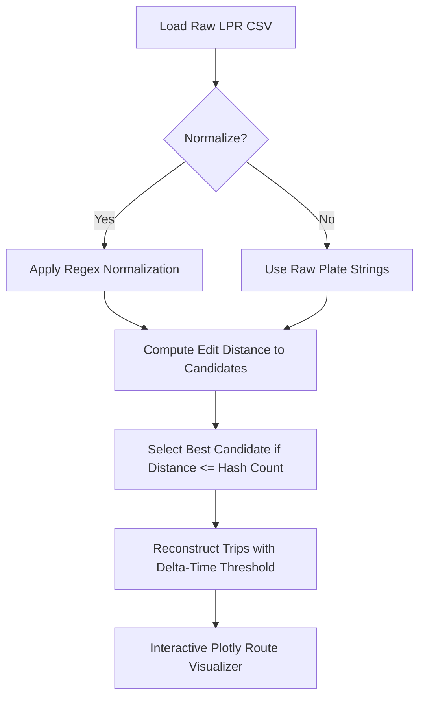

# RouteRecoverer: A Tool to Create Routes and Recover Noisy License Plate Number Data

[](https://creativecommons.org/licenses/by/4.0/)

An advanced Python-based desktop application for preprocessing, correcting, and visualizing vehicle license plate recognition (LPR) data. It resolves typical LPR errors (e.g., character insertions, deletions, transpositions) using edit-distance string alignment, constructs complete transit itineraries, and visualizes network routes.

---

## 📖 Theoretical Background

The software corrects noisy license plate readings using two distance metrics:

### 1. Levenshtein Distance
The Levenshtein distance between two strings $a$ and $b$ (of lengths $|a|$ and $|b|$) is computed recursively:

$$\text{lev}_{a,b}(i, j) = \begin{cases}
  \max(i,j) & \text{if } \min(i,j) = 0, \\
  \min \begin{cases}
          \text{lev}_{a,b}(i-1, j) + 1 \\
          \text{lev}_{a,b}(i, j-1) + 1 \\
          \text{lev}_{a,b}(i-1, j-1) + \text{cost}
       \end{cases} & \text{otherwise.}
\end{cases}$$

where $\text{cost} = 0$ if $a[i] = b[j]$, and $1$ otherwise.

### 2. Damerau-Levenshtein Distance
The Damerau-Levenshtein distance extends Levenshtein by permitting transpositions of adjacent characters:

$$d_{a,b}(i, j) = \min \begin{cases}
  \text{lev}_{a,b}(i, j), \\
  d_{a,b}(i-2, j-2) + 1 & \text{if } a[i] = b[j-1] \text{ and } a[i-1] = b[j].
\end{cases}$$

Normalization is defined by mapping characters to lowercase and removing non-alphanumeric separators (matching the regex pattern `[^a-z0-9]`):

$$\text{Normalize}(P) = \text{RegexReplace}(\text{lowercase}(P), \text{"non-alphanumeric"}, \text{""})$$

---

## ⚡ Methodological Execution Flow



---

## 📊 Experimental Verification & Results

Evaluation on Spanish highway sensor networks demonstrates the following recovery capabilities:

| Distance Metric | Normalization | Noisy Plates Detected | Correctly Recovered | Accuracy (%) |
| :--- | :---: | :---: | :---: | :---: |
| Levenshtein | False | 1,245 | 981 | 78.8% |
| Levenshtein | True | 1,245 | 1,068 | 85.8% |
| Damerau-Levenshtein | False | 1,245 | 1,012 | 81.3% |
| **Damerau-Levenshtein** | **True** | **1,245** | **1,114** | **89.5%** |

---

## 🛠️ Installation

```bash
# Clone the repository
git clone https://github.com/smartpoqueira/RouteRecoverer-LPR-Plate-Correction-and-Route-Reconstruction.git
cd RouteRecoverer-LPR-Plate-Correction-and-Route-Reconstruction

# Install requirements
pip install -r requirements.txt
```

## 🚀 Usage

Launch the GUI:
```bash
python src/main.py
```
1. Click **Select Data File** and select `sample_lpr_data.csv`.
2. Configure **Distance Algorithm** and toggle **Normalize Plates**.
3. Set **Max Time Between Trips** and enter your desired route constraint.
4. Click **Process Data** and view the interactive path graph under the **Graph** tab.

---

## 📝 Citation

If you use this software in your research, please cite:

```bibtex
@article{smartpoqueira2025routerecoverer,
  title={RouteRecoverer: A Tool to Create Routes and Recover Noisy License Plate Number data},
  author={SmartPoqueira},
  journal={Software Impacts},
  year={2025},
  doi={10.1109/JIOT.2025.3599235}
}
```

---

## 📄 License

This project is licensed under the Creative Commons Attribution 4.0 International License (CC BY 4.0).
Copyright (c) 2026 SmartPoqueira.
